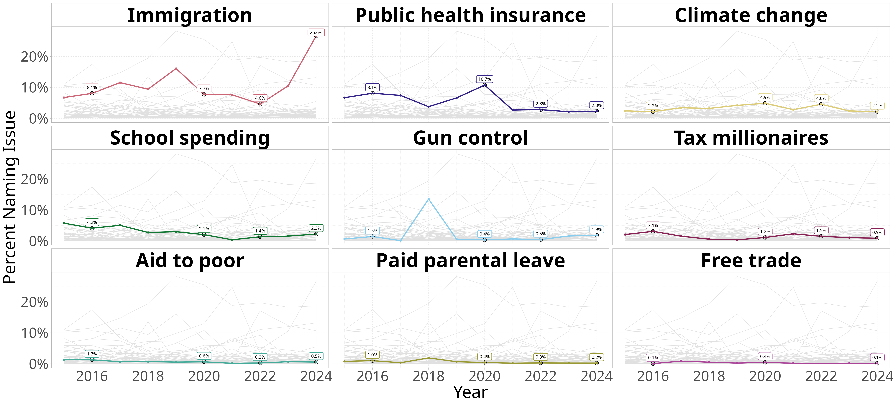
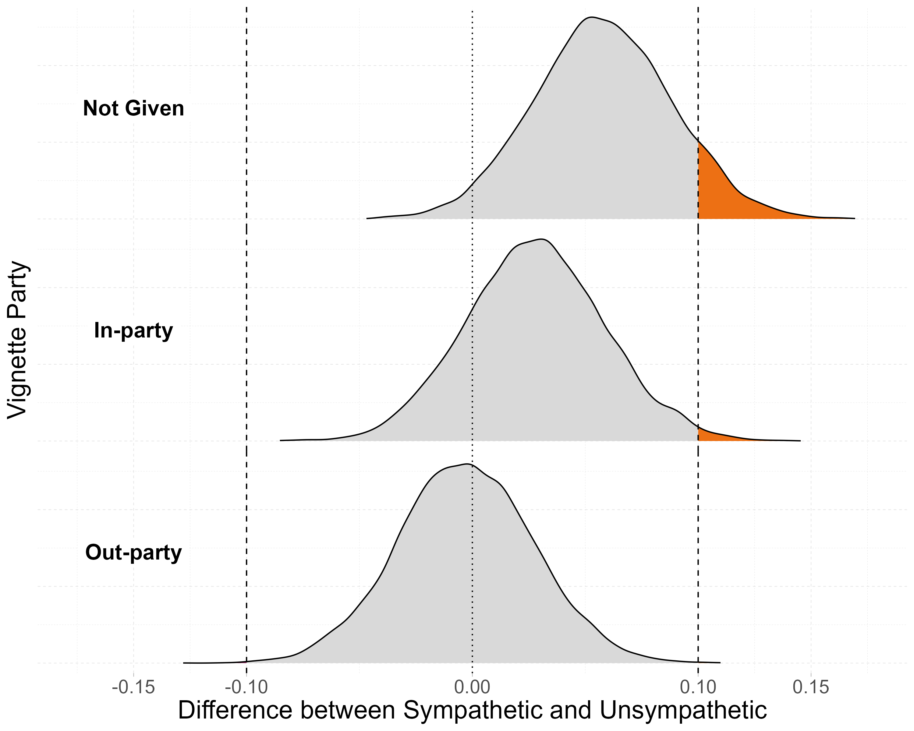
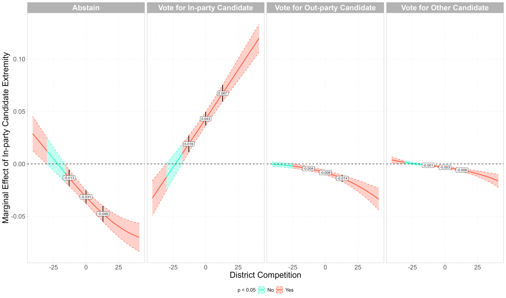

<style>
  /* Hide the title element on the page */
  .title {
    display: none;
  }
</style>

I spend far too much time thinking about data visualization. To make that time a little more productive for myself, I'll use this part of the website to show off whatever graphs I've most recently made for the projects I'm working on, as well as the accompanying code.

```{r include = FALSE}
knitr::opts_chunk$set(warning=FALSE, message=FALSE, eval = FALSE)
```

## Most Important Problem Over Time

In [this paper](https://www.dropbox.com/scl/fi/con186lxj9mm5myj0h300/cutler_affective_polarization_policy_APSA_2025.pdf?rlkey=wmmiwswqrvry38vxsl6uyj05v&st=sn3gwmw0&dl=0) I examine the relationship between affective polarization and policy attitudes. One of the arguments I make is that the previous literature examining this relationship focused to heavily on high salience issues. To make this point, I got access to the Gallup Poll Social Series over time data and analyzed the commonly used "most important problem" question responses. For part of this, I needed to bin some responses to match the policies I was using in my paper, and wanted to show how it varies over time. I focused on 2016-2024 since that is when I have panel data for in my main analysis. This is also a figure that I had help from Claude to make. I created the underlying structure of the figure on my own, and knew I was going to need to repeatedly stack the data to get the figure to look how I wanted. Claude wrote the code for stacking the data, and updated some of my code to clean up some parts of the figure. I then added in the labels, and added in the circles highlighting the points where I actually have data, which almost happened on accident at first. The end result shows the 9 policy labels, with all 70+ other policies in the background. I tried to be generous when binning policies just due to how low each policy is with there being so many. The figure and its code can be found below.



```{r}
#| code-fold: true
library(tidyverse)
library(kableExtra)

## theme setting
theme_set(theme_light() +
            theme(legend.position = 'none',
                  panel.grid = element_line(linetype = 2,
                                            color = alpha('lightgray', .6)),
                  strip.background = element_rect(fill = 'white', color = 'gray'),
                  strip.text   = element_text(color = 'black', size = 35,
                                              face = 'bold'),
                  axis.title = element_text(size = 30),
                  axis.text  = element_text(size = 25)))

#loading in gallup data
haven::read_dta('anes/data/mip/GPSS Environment Final GA Aggregate.dta') -> gallup

##getting just the years we care about
target_issues <- c('Immigration', 'Climate change', 'Public health insurance',
                   'Gun control', 'School spending', 'Aid to poor',
                   'Free trade', 'Tax millionaires', 'Paid parental leave')

gallup %>% 
  select(id,wtfctr,yr,fips,mip1,mip2,mip3,partyr) %>% 
  mutate(across(contains('mip'), ~labelled::to_factor(.)),
         across(contains('mip'), ~str_to_lower(.)),
         across(contains('mip'), ~case_when(str_detect(.,'gun|shooting') ~ 'Gun control',
                                            str_detect(.,'trade') ~ 'Free trade',
                                            str_detect(.,'education') ~ 'School spending',
                                            str_detect(.,'welfare') ~ 'Aid to poor',
                                            str_detect(.,'rich') ~ 'Tax millionaires',
                                            str_detect(.,'immigration|undocumented') ~ 'Immigration',
                                            str_detect(.,'environment|energy') ~ 'Climate change',
                                            str_detect(.,'insurance|health') ~ 'Public health insurance',
                                            str_detect(.,'children|family') ~ 'Paid parental leave',
                                            . %in% c('dk','other','79','80','96') ~ NA,
                                            TRUE ~ .),
                .names = '{.col}_clean'),
         mip_any = case_when(
           mip1_clean %in% target_issues ~ mip1_clean,
           mip2_clean %in% target_issues ~ mip2_clean,
           mip3_clean %in% target_issues ~ mip3_clean,
           TRUE                  ~ mip1_clean
         ),
         partyr  = case_when(partyr == 1 ~ 'Republican',
                             partyr == 2 ~ 'Independent',
                             partyr == 3 ~ 'Democrat',
                             TRUE ~ NA)) -> gallup_mip 

##weighted numerator
gallup_mip %>%
  filter(!is.na(wtfctr)) %>%
  pivot_longer(c(mip1_clean, mip2_clean, mip3_clean),
               names_to = "mention", values_to = "issue") %>%
  filter(!is.na(issue)) %>%          # <- unanswered mip2 / mip3
  distinct(id, yr, wtfctr, issue) %>%
  count(yr, issue, wt = wtfctr) -> numer

##weighted denominator
gallup_mip %>%
  filter(!is.na(wtfctr)) %>%
  distinct(id, yr, wtfctr) %>%
  count(yr, wt = wtfctr, name = "total") -> denom

##getting proportions
numer %>% 
  left_join(denom, by = 'yr') %>% 
  mutate(per = n / total) -> mip_t

#plot
# order facets by mean salience so the variation reads left to right
all_dat <- mip_t %>%
  filter(yr <= 2024&yr >= 2015, !is.na(issue))

target_dat <- all_dat %>% filter(issue %in% target_issues)

issue_levels <- target_dat %>%
  group_by(issue) %>%
  summarise(m = mean(per, na.rm = TRUE), .groups = "drop") %>%
  arrange(desc(m)) %>%
  pull(issue)

# background: every issue in the data except the focal one, in each facet
bg <- map_dfr(issue_levels, function(f) {
  all_dat %>%
    filter(issue != f) %>%
    transmute(yr, per, series = issue, facet = f)
}) %>%
  mutate(facet = factor(facet, levels = issue_levels))

fg <- target_dat %>%
  transmute(yr, per, series = issue,
            facet = factor(issue, levels = issue_levels))

#now getting the labels
highlight_yrs <- c(2016, 2020, 2022, 2024)

lab_dat <- fg %>% filter(yr %in% highlight_yrs)

#making the plot
bg %>% 
  ggplot() +
  geom_line(aes(yr, per, group = series),
            color = "grey88", linewidth = 0.3) +
  geom_line(data = fg, aes(yr, per, color = facet), linewidth = 1) +
  geom_point(data = fg, aes(yr, per, color = facet), size = 1.2) +
  # emphasise the highlighted years
  geom_point(data = lab_dat, aes(yr, per), color = 'black',
             size = 2.75, shape = 1) +
  ggrepel::geom_label_repel(
    data = lab_dat,
    aes(yr, per, color = facet,
        label = scales::percent(per, accuracy = 0.1)),
    size = 2.8,
    label.size = 0.4,
    direction = "y",          # vertical only, so labels stay over their year
    nudge_y = 0.01,
    min.segment.length = Inf, # no connector lines
    seed = 117
  ) +
  ggrepel::geom_label_repel(
    data = lab_dat,
    aes(yr, per,
        label = scales::percent(per, accuracy = 0.1)),
    color = 'black',
    fill = NA,
    label.size = 0,
    size = 2.8,
    direction = "y",
    nudge_y = 0.01,
    min.segment.length = Inf,
    seed = 117                    # SAME seed, or the layers won't align
  ) +
  facet_wrap(vars(facet), ncol = 3) +
  scale_x_continuous(breaks = c(2016,2018,2020,2022,2024)) +
  scale_y_continuous(labels = scales::percent) +
  #scale_color_brewer(palette = 'Set1') +
  scale_color_manual(values = khroma::color('muted')(9))+
  guides(color = "none") +
  labs(x = 'Year', y = 'Percent Naming Issue')

```

## Posterior Distribution of Treatment Effects

This paper explores if race influences people's policy positions by serving as a cue for partisanship, or through some other mechanism, such as linked-fate or group affect towards racial groups. More details on this paper can be found in my [research section](research.qmd). The main results in the paper are shown using standard coefficient plots. While I'm confident that's the best way to show these results, the figure below shows posterior distribution of the difference between racial groups based on party. I'm aware that this looks like a very standard `ggridges` plot, however, I did not use `ggridges` because, as I discuss below as well the PVI figure, `ggplot` does a very poor job at varying the fill in a graph across the x-axis. However, with density plots, this is even worse as `ggplot` estimate the density grouping by the fill variable, resuting in a figure that does not really make sense. How I worked around this was by manually estimating the density, and then graphing it using a line and area plot. \*Disclaimer, this figure was generated using a little bit of help from ChatGPT.



```{r}
#| code-fold: true

# Step 1: Compute densities per group
density_data <- draws %>%
  group_by(v_party) %>%
  group_map(~ {
    min_x <- min(.x$diffs)
    max_x <- max(.x$diffs)
    d <- density(.x$diffs, from = min_x, to = max_x, n = 5000)
    tibble(x = d$x, y = d$y, v_party = .y$v_party)
  }) %>%
  bind_rows()


# Step 2: Assign threshold region based on x
density_data <- density_data %>%
  mutate(thresh = case_when(
    x < -0.1 ~ 'negative',
    x >= -0.1 & x <= 0.1 ~ 'neither',
    x > 0.1 ~ 'positive'
  ))

# Optional: Set ordering for thresh to control fill colors later
density_data$thresh <- factor(density_data$thresh, levels = c('negative', 'neither', 'positive'))

#making text label dataframe
tibble(x = -.15, y = 7.25, 
       thresh = 'negative',
       v_party = factor(c('Not Given', 'In-party', 'Out-party'),
                        levels = c('Not Given', 'In-party', 'Out-party'))) -> lab_dat 

#get the percent of observations in each category for labeling
draws %>%
  select(v_party,diffs) %>% 
  mutate(thresh = case_when(diffs < -.1 ~ 'negative',
                            (diffs >= -.1 & diffs < .1) ~ 'neither',
                            diffs >= .1 ~ 'positive'),
         thresh2 = case_when(diffs > 0.0001 ~ 'positive',
                             diffs < -0.0001 ~ 'negative',
                             (diffs > -0.0001 & diffs < 0.0001) ~ 'neither')) %>% 
  group_by(v_party) %>%
  mutate(pg = n()) %>% 
  group_by(v_party,thresh) %>% 
  summarize(per = n()/unique(pg),
            .groups = 'drop') 

# Step 3: Plot the precomputed densities with fill by threshold
density_data %>% 
  ggplot(aes(x = x, y = y, fill = thresh)) +
  geom_area(color = "black") +
  facet_grid(vars(v_party),switch = 'y') +
  geom_vline(aes(xintercept = .1), linetype = 2)+
  geom_vline(aes(xintercept = -.1), linetype = 2)+
  geom_vline(aes(xintercept = 0), linetype = 3)+
  labs(x = 'Difference between Sympathetic and Unsympathetic',
       y = 'Vignette Party')+
  scale_fill_manual(values = c('negative' = '#9F2B68',
                               'neither'  = 'gray85',
                               'positive' = '#ED7014'))+
  geom_label(data = lab_dat, size = 6, fontface = 'bold',
             fill = 'white', label.size = NA,
            aes(x=x,y=y, label = v_party))+
  scale_x_continuous(breaks = c(-.15,-.1,0,.1,.15),
                     limits = c(-.175,.175))+
  theme(
    legend.position = 'none',
    strip.text.y.left = element_blank(),#element_text(angle = 0, hjust = 0.5,
                        #             size = 15),
    axis.text.y = element_blank(),
    axis.ticks.y = element_blank(),
    strip.background = element_blank(),
    panel.spacing = unit(0, "lines"),
    panel.border = element_blank())

```

### The Average Marginal Effect of In-party Candidate Extremism by District Partisan Advantage (2010 to 2022)

The paper this figure is in can be found [here](https://www.dropbox.com/scl/fi/4vlq73wrfprx04hboxlan/CHR__Political_Extremism_Penalty_.pdf?rlkey=gqp8x5i6wd8anktrkjn0m71dk&dl=0). The goal of this figure is to show how the average marginal effect of the ideological extremity of a respondent in the CES's in-party candidate varies based on the level of district competition. The code below only includes the code for this figure specifically and not the remainder of the analysis. The tricky thing with this figure was getting the regions to be fully continuous, as PVI as an integer variable. Part of the code creates synthetic data at the points in between where the marginal effect is not significant and where it is to make the regions seamlessly change. I am not sure why `geom_ribbon()` does not just do this in the first place, but the approach I used worked just fine.



```{r}
#| code-fold: true

library(tidyverse)
library(mclogit)

##reading in the data from before
read_rds('observational/cleaned data/ces_cleaned.rds') -> ces_cand_ideo_val

read_csv('observational/data/extra_vars/pvi_all.csv') %>% 
  filter(str_detect(seat, 'house') == TRUE) %>% 
  rename(cd = district) %>% 
  mutate(year = factor(year,
                       levels = levels(ces_cand_ideo_val$year)),
         cd   = str_replace(cd, "(\\D)(\\d)", "\\1-\\2")) %>% 
  janitor::clean_names() -> pvi

theme_set(theme_light()+
            theme(legend.position = 'bottom',
                  legend.text = element_text(size = 12),
                  legend.title = element_text(size = 12),
                  panel.grid = element_line(linetype = 2,
                                            color = alpha('lightgray',.6)),
                  strip.text   = element_text(color = 'white', size = 18,
                                              face = 'bold'),
                  axis.title = element_text(size = 20),
                  axis.text  = element_text(size = 15)))

###################################
#insert code for the analysis here#
###################################

##in-party
expand.grid(
  h_in_ext    = seq(from = min(ces_cand_ideo_val$h_in_ext, na.rm = TRUE), 
                    to = max(ces_cand_ideo_val$h_in_ext, na.rm = TRUE),
                    by = .01),
  pvi         = seq(from = min(ces_cand_ideo_val$pvi, na.rm = TRUE), 
                    to = max(ces_cand_ideo_val$pvi, na.rm = TRUE),
                    by = 1),
  h_out_ext   = median(ces_cand_ideo_val$h_out_ext, na.rm = TRUE),
  pid_str     = median(ces_cand_ideo_val$pid_str, na.rm = TRUE),
  ideo_str    = median(ces_cand_ideo_val$ideo_str, na.rm = TRUE),
  age         = median(ces_cand_ideo_val$age, na.rm = TRUE),
  age2        = median(ces_cand_ideo_val$age2, na.rm = TRUE),
  educ2       = median(ces_cand_ideo_val$educ2, na.rm = TRUE),
  race2       = median(ces_cand_ideo_val$race2, na.rm = TRUE),
  gender      = factor('Female',
                       levels = c(levels(ces_cand_ideo_val$gender))),
  cd          = as.factor(factor('AZ-02')),
  year        = as.factor(median(as.numeric(as.character(ces_cand_ideo_val$year))))) -> test_i2

marginaleffects::slopes(fit, newdata = test_i2, variables = 'h_in_ext',
                        type = 'response', by = 'pvi') %>% 
  as_tibble() %>% 
  rename(vote_choice = group) %>% 
  select(vote_choice, pvi, estimate, conf.low,conf.high,predicted,
         predicted_lo,predicted_hi,p.value) %>% 
  mutate(vote_choice = case_when(vote_choice == 'no_turnout' ~ 'Abstain',
                                 vote_choice == 'in_party' ~ 'Vote for In-party Candidate',
                                 vote_choice == 'out_party' ~ 'Vote for Out-party Candidate',
                                 vote_choice == 'other_cand' ~ 'Vote for Other Candidate'),
         vote_choice = factor(vote_choice,
                              levels = c('Abstain',
                                         'Vote for In-party Candidate',
                                         'Vote for Out-party Candidate',
                                         'Vote for Other Candidate'))) -> margin_in_full
##graphing it
margin_in_full %>% 
  mutate(sig   = ifelse(p.value < .05, 'Yes', 'No'),
         group = consecutive_id(sig)) -> margin_in_full

###making extra observations to fill in gaps on figure
margin_in_full %>% 
  group_by(vote_choice,group) %>% 
  filter(row_number() == 1|row_number() == n()) %>% 
  group_by(vote_choice) %>% 
  filter(abs(pvi) != 41) %>% 
  ungroup() %>% 
  mutate(group1 = rep(c(1:(nrow(.)/2)),each = 2)) -> group_dat 
  
group_dat %>% 
  group_by(group1) %>% 
  complete(pvi = full_seq(pvi,.01)) %>% 
  fill(vote_choice,sig,group, .direction = 'downup') %>%
  mutate(across(c(estimate,conf.low,conf.high),
                ~seq(first(.), last(.), length.out = n()))) %>% 
  ungroup() %>% 
  filter(!pvi %in% unique(ces_cand_ideo_val$pvi)) %>% 
  select(-group1) %>% 
  group_by(vote_choice) %>% 
  distinct(pvi, .keep_all = TRUE) %>% 
  ungroup() -> fill_obs


#putting it all together for the figure
margin_in_full %>% 
  bind_rows(fill_obs) %>% 
  ggplot(aes(x = pvi, y = estimate,
             ymin = conf.low, ymax = conf.high))+
  geom_ribbon(aes(color = sig, fill = sig,group = group), 
              alpha = 0.3, linetype = 2)+
  geom_line(aes(color = sig, group = group),
            linewidth = 1)+
  geom_hline(aes(yintercept = 0), linetype = 2)+
  geom_pointrange(data = filter(margin_in_full, abs(pvi) == 13|pvi==0),
                  linewidth = .75)+
  geom_label(data = filter(margin_in_full, abs(pvi) == 13|pvi==0),
             aes(label = round(estimate, 3)), size = 3)+
  facet_wrap(vars(vote_choice), nrow = 1)+
  labs(y = 'Marginal Effect of In-party Candidate Extremity', 
       x = 'District Competition',
       color = 'p < 0.05', fill = 'p < 0.05')+
  scale_color_manual(values = c('Yes' = '#ff664d', 'No' = '#33ffcc'))+
  scale_fill_manual(values = c('Yes' = '#ff664d', 'No' = '#33ffcc'))

```

### Data Dashboard

Part of my work with the LeRoy Collins Institute has been to work on our election audit dashboard. For this, I created an interactive dashboard using `shiny` to display both the audit data and ballot images for several elections from Leon county. We're currently working to expand the project to several other counties. The data dashboard for the 2024 general election in Leon county can be found below, but can be opened in full screen (which is a better experience in my opinion) by clicking [here](https://lci-dashboards.duckdns.org/leon-gen-2024/). The dashboards for other years can be found on [our website](https://www.voterdata.lci.fsu.edu/).

<div>
  <iframe src="https://lci-dashboards.duckdns.org/leon-gen-2024/" width="1300" height="800" style="border: .5px solid black; margin-left: -225px;"></iframe>
</div>

```{r eval = FALSE}
#| code-fold: true

# Load necessary libraries and read data
library(tidyverse)
library(htmlwidgets)
library(DT)
library(sf)
library(shiny)
library(shinydashboard)
library(plotly)
library(shinyWidgets)
library(htmltools)
library(leaflet)

options(scipen = 999)

table_1 <- read_csv('table_1.csv')

table_1 %>% 
  mutate(`Difference_Choice Recorded` = `Difference_Choice Recorded`*-1,
         `Difference_Ballots Counted` = `Difference_Ballots Counted`*-1) %>% 
  select(Contest, Choice, `Dominion_Ballots Counted`, `ClearBallot_Ballots Counted`,
         `Difference_Ballots Counted`, `Dominion_Choice Recorded`, `ClearBallot_Choice Recorded`,
         `Difference_Choice Recorded`,`Overvoted WithVote for this Choice`, 
         `Undervoted WithoutVote for this Choice`) %>% 
  rename('Ovals \n Counted \n Dominion'    = `Dominion_Ballots Counted`, 
         'Audit Ovals \n Counted \n ClearBallot' = `ClearBallot_Ballots Counted`,
         'Difference in \n Ovals \n Counted' = `Difference_Ballots Counted`, 
         'Certified\nVote Count'     = `Dominion_Choice Recorded`, 
         'Audit\nVote Count'  = `ClearBallot_Choice Recorded`,
         'Difference\nin Counts'     = `Difference_Choice Recorded`,
         'Over \n Vote'                            = `Overvoted WithVote for this Choice`, 
         'Under \n Vote'                           =`Undervoted WithoutVote for this Choice`) %>% 
  select(-contains('Ovals')) -> table_1

table_2 <- fst::read_fst('leon_2024g.fst')

table_2 %>% 
  rename('Ballot ID'              = BallotID,
         'Choice'                 = cand,
         'Vote Type'              = vote_type,
         'Ballot Link'            = view_ballot,
         #'Oval Confidence Rank'   = oval_confidence_rank,
         'Voting Method'          = vote_mode,
         'Precinct'               = PrecinctID) -> table_2

st_read('Shape files - combined precincts', layer = 'Leon_ShapeFile') %>% 
  mutate(PRECINCT = str_replace_all(PRECINCT, '/', ' & ')) -> map

st_transform(map,crs = 4326) -> map

Sys.setenv('MAPBOX_TOKEN' = 'pk.eyJ1IjoiYXVzdGluLWN1dGxlciIsImEiOiJjbGt0enpwZG4wMW5iM3NsaDAxNjBoMm5nIn0.oBeanbdPK0aurRNUJG7jIg')


outline <- function(x){
  htmlwidgets::onRender(x,
                        "function(el, x) {
                          // Add hover event
                          el.on('plotly_hover', function(data) {
                            // Loop through each point hovered over
                            data.points.forEach(function(point) {
                              Plotly.restyle(el, {'marker.line.color': 'black', 'marker.line.width': 2}, [point.curveNumber]);
                            });
                          });
                          // Add unhover event to reset the color
                          el.on('plotly_unhover', function(data) {
                            data.points.forEach(function(point) {
                              Plotly.restyle(el, {'marker.line.color': 'rgba(0,0,0,0)', 'marker.line.width': 0}, [point.curveNumber]);
                            });
                          });
                        }
                        "
  )
}

ui <- fluidPage(
  tags$div(id = "map"),
  verbatimTextOutput("selected_precinct"),
  tags$head(
    tags$style(HTML(
      '.sidebar-toggle{position: absolute; left: 0;}',
      '.skin-blue .main-header .logo {
        background-color:  white;
      }',
      '.skin-blue .main-header .logo:hover {
          background-color:  white;
        }',
      '.skin-blue .sidebar-menu>li>a{
        background-color:white;
        border-bottom: 1px solid #000000;
      }',
      '.skin-blue .sidebar-menu>li>a:hover{
        background-color:white;
        border-left: 3px solid #782F40;
      }',
      '.skin-blue .main-header .navbar {
          background-color:  white;
          margin-left: 0px !important;
        }',
      '.skin-blue .main-sidebar {
          background-color:  white;
        }',
      '.skin-blue .main-sidebar .sidebar .sidebar-menu .active a{
          background-color: white;
        }',
      '.skin-blue .main-header .logo {
        background-color:  white;
        color: black;
      }',
      '.skin-blue .main-header .logo:hover {
          background-color:  white;
        }',
      '.skin-blue .main-header .navbar {
          background-color:  white;
          color: #000000;
        }',
      '.skin-blue .main-header .navbar .sidebar-toggle {
          color: #000000;
          background-color: #dfedeb;
          border-bottom: 2px solid black;
          border-right: 2px solid black;}',
      '.skin-blue .main-header .navbar .sidebar-toggle:hover {
          background-color: #782F40;}',
      '.skin-blue .main-sidebar {
          background-color:  white;
        }
      ',
      'skin-blue .main-sidebar .sidebar .sidebar-menu .active a{
          background-color: #782F40;
        }',
      '.main-header .sidebar-toggle:before {
        content: "Filter Dashboard";
        font-family: calibri;
        font-size: 15px;
        font-weight: 900;
      }',
      ".content-wrapper { background-color: white; margin: 0}",
      '.container-fluid {font-size: 12px; padding: 0}',
      ".custom-select-wrapper {margin:1px; background-color: #dfedeb;}",
      ".custom-select {margin:1px; width: 100%; max-width: 350px; background-color: #dfedeb;}",
      ".stripe tbody tr:nth-child(even) { background-color: #dfedeb; }",
      '.shiny-input-container:not(.shiny-input-container-inline){max-height: 43px;color: #000000; background-color: white;}',
      '.shiny-input-checkboxgroup {margin:1px; background-color: white; justify-content: center; color: #000000;}',
      '.shiny-input-checkboxgroup.shiny-input-container-inline label~.shiny-options-group, .shiny-input-radiogroup.shiny-input-container-inline label~.shiny-options-group{margin-left: 1px}',
      '.js-irs-0 {background: #dfedeb; }',
      '.js-irs-0 .irs-bar-edge {background: #dfedeb; }',
      '.box {margin:1px; border: 1px solid white; -webkit-box-shadow: none; -moz-box-shadow: none;box-shadow: none;}', 
      '.box-header { background-color: #f9f9f9; }',
      '.selectize-control { padding-left: 7px; padding-right: 7px; margin-bottom:100px;color: #000000;}',
      '.shiny-input-radiogroup {margin: 1px; background-color: white; justify-content: center;color: #000000;}',
      ".plotly { max-width: 100%;margin:1px }",
      ".content-body {margin:1px; padding: 0; }",
      ".dataTable-wrapper { margin: 1px;}",
      ".row { margin-bottom: 0; }",
      '.col-special {margin-right:-15px}',
      '.box-body {padding: 1px}',
      '.total-table{margin:0; justify-content: center}',
      '.link{color: #782F40; font-size: 25px; color: #782F40;font-weight: bold}',
      '.link:hover{color: #00524d}'
    )),
    tags$script(
      "$(document).ready(function(){
    var mapPlots = document.getElementsByClassName('plotly');
    if (mapPlots.length > 0) {
      for (var i = 0; i < mapPlots.length; i++) {
        mapPlots[i].addEventListener('plotly_relayout', function(eventdata){
          Plotly.relayout(this, {autosize: true});
        });
      }
    }
  });"
    )
  ),
  dashboardPage(
    dashboardHeader(),
    dashboardSidebar(collapsed = TRUE,
                     sidebarMenu(h2(style = 'text-align: left; 24px; font-weight: bold; color:  #782F40;',
                                    div(HTML('<p>Audit Filters</p>'))),
                                 menuItem(div(style = 'padding-bottom: 20px',
                                              selectInput("Contest", label = "Contest",
                                                          selected = 'President and Vice President',
                                                          choices = c('All', unique(table_1$Contest))))),
                                 menuItem(selectInput("Candidate", label = "Choice",
                                                      choices = c("All", unique(table_1$Choice)))),
                                 h2(style = 'text-align: left; 24px; font-weight: bold; color: #782F40;',
                                    div(HTML('<p>Ballot Filters</p>'))),
                                 menuItem(radioButtons("OvalCat", label = "Oval Confidence Rank",
                                                       choices = c("All", '1-20'), inline = TRUE, selected = 'All')),
                                 menuItem(checkboxGroupInput("VotingMethod", label = "Voting Method",
                                                             selected = c('Election Day Vote'),
                                                             choices = c(unique(table_2$`Voting Method`)),
                                                             inline = TRUE)),
                                 menuItem(selectInput("Precinct", label = "Precinct",
                                                      choices = c("All", unique(table_2$Precinct)))),
                                 menuItem(checkboxGroupInput("VoteType", label = "Vote Type", 
                                                             choices = c('Voted for Choice',
                                                                         'Voted for Other Choice',
                                                                         'Overvote', 'Undervote'),  
                                                             selected = c('Voted for Choice'),
                                                             inline = TRUE)))
    ),
    dashboardBody(
      tags$script(
        HTML(
          "$(document).on('shiny:connected', function(event) {
    $(document).on('click', function(evt) {
        // Get the sidebar element
        var el = document.getElementById('sidebarCollapsed');
        
        // Check if the click is outside the sidebar and if the sidebar is currently not collapsed
        if (!$(evt.target).closest('#sidebarCollapsed').length && el.getAttribute('data-collapsed') !== 'true') {
            // Collapse the sidebar and set data-collapsed to true
            el.setAttribute('data-collapsed', 'true');
            $('body').addClass('sidebar-collapse'); // Collapse the sidebar using the class
        }
    });

    // Event to reopen the sidebar when the toggle button is clicked
    $('#sidebar-toggle').on('click', function() {
        var el = document.getElementById('sidebarCollapsed');
        
        // Toggle data-collapsed attribute between 'true' and 'false'
        if (el.getAttribute('data-collapsed') === 'true') {
            el.setAttribute('data-collapsed', 'false');
            $('body').removeClass('sidebar-collapse'); // Remove class to expand sidebar
        } else {
            el.setAttribute('data-collapsed', 'true');
            $('body').addClass('sidebar-collapse'); // Add class to collapse sidebar
        }
    });
});
$(document).on('click', '#resetButton', function() {
      Shiny.setInputValue('reset_map_filter', Math.random());
    });
"
        )),
fluidRow(column(width=5,
                box(width = 12, solidHeader = TRUE,
                    div(HTML('<p> <a class = "link" 
         href="https://fsu.qualtrics.com/jfe/form/SV_dj1SffcmA9nC4dw">Click here to tell us about your experience!</a></p>')))),
         column(width = 7,
                box(width = 12,
                    h3("Aggregate Audit Data", style = "text-align: left; font-size: 24px; font-weight: bold; margin: 0;"))
         )
),
fluidRow(
  box(width = 3, solidHeader = TRUE,
      column(width = 12, 
             
      )
  ),
  column(width = 12,
         box(width = 4, solidHeader = TRUE,
             #h3("space", style = "text-align: left; font-size: 24px; font-weight: bold; margin: 0;color:white;"),
             div(style = "display: flex; justify-content: center;",
                 div(style = "width: 100%; height: 100%;", 
                     plotlyOutput("diff_plot")
                 )
             )
         ),
         box(width = 4, solidHeader = TRUE,
             
             div(style = "display: flex; justify-content: center;",
                 div(style = "width: 100%; height: 100%;", 
                     plotlyOutput("ag_plot1")
                 )
             )
         ),
         #box(width = 3, solidHeader = TRUE,
         
         #     div(style = "display: flex; justify-content: center;",
         #         div(style = "width: 100%; height: 100%;", 
         #             plotlyOutput("ag_plot2")
         #         )
         #     )
         # ),
         box(width = 4, solidHeader = TRUE,
             
             div(style = "display: flex; justify-content: center;",
                 div(style = "width: 100%; height: 100%;", 
                     plotlyOutput("ag_plot3")
                 )
             )
         )
  )
),
fluidRow(
  box(width = 12,
      div(
        DTOutput("my_table")
      )
  ),
  fluidRow(
    column(width = 10),
    column(width = 1,
           downloadButton('aud_tab_download', 'Download Audit Data'))
  )
),
fluidRow(
  box(width = 8, solidHeader = TRUE,
      div(
        DTOutput("my_table_2"))
  ),
  column(width = 4,
         box(width = 12, solidHeader = TRUE,
             h3("Leon County Precincts", style = "text-align: center; font-size: 24px; font-weight: bold; margin: 0;"),
             div(style = "display: flex; justify-content: center;",
                 div(style = "width: 100%; height: 100%;", 
                     leafletOutput("map_plot")
                 )
             )
         )
  )
)
    )
  )
)

# Create the Shiny app server
server <- function(input, output, session) {
  
  filtered_table <- reactive({
    filtered <- table_1
    
    # Handle Contest filter
    if (input$Contest != "All" && !is.null(input$Contest)) {
      filtered <- filter(filtered, Contest == input$Contest)
    }
    
    if (input$Candidate != 'All' && !is.null(input$Candidate)){
      filtered <- filter(filtered, Choice == input$Candidate)
    }
    
    filtered 
  })
  
  
  sketch <- htmltools::tags$table(
    tableHeader(names(table_1)),
    tableFooter(rep("", ncol(table_1)))
  )
  
  output$my_table <- renderDT({
    datatable(filtered_table(), filter = 'none', 
              escape = FALSE, 
              options = list(scrollY = 200, dom = 'Bfrtip', lengthMenu = list(-1),
                             searching = FALSE, info = FALSE, paging = FALSE),
              rownames = FALSE, 
              selection = 'none',
              class = 'cell-border stripe',
              fillContainer = TRUE,
              container = sketch
    )
  })
  
  output$aud_tab_download <- downloadHandler(filename = 'audit_data.csv',
                                             content = function(con){
                                               write_csv(filtered_table(), con)
                                             })
  
  filtered_choices <- reactive({
    choices <- c('All', unique(table_1$Choice))
    
    # Handle Contest filter
    if (input$Contest != "All" && !is.null(input$Contest)) {
      choices <- c('All', unique(table_1$Choice[table_1$Contest == input$Contest]))
    }
    
    choices
  })
  
  observe({updateSelectInput(session, inputId="Candidate", 
                             choices = c(filtered_choices()),
                             selected = 'All')})
  
  output$ag_plot1 <- renderPlotly({ 
    if (input$Contest != "All") {
      
      #making the plot data
      aggregated_data1 <- filtered_table() %>% 
        group_by(Contest) %>% 
        select(-contains('Difference')) %>% 
        summarize(across(where(is.numeric), \(x) sum(x, na.rm = TRUE)),
                  `Under \n Vote` = `Under \n Vote`/n()) %>% 
        pivot_longer(cols = c(`Certified\nVote Count`:`Under \n Vote`),
                     values_to = 'Count') %>% 
        filter(name %in% c('Audit\nVote Count',
                           'Certified\nVote Count')) %>% 
        mutate(name = factor(name,
                             levels = c('Certified\nVote Count',
                                        'Audit\nVote Count')))
    }
    
    if (input$Contest == "All" && !is.null(input$Contest)) {
      aggregated_data1 <- filtered_table() %>% 
        select(-contains('Difference')) %>% 
        summarize(across(where(is.numeric), \(x) sum(x, na.rm = TRUE))) %>% 
        pivot_longer(cols = c(`Certified\nVote Count`:`Under \n Vote`),
                     values_to = 'Count') %>% 
        filter(name %in% c('Audit\nVote Count',
                           'Certified\nVote Count')) %>% 
        mutate(name = factor(name,
                             levels = c('Certified\nVote Count',
                                        'Audit\nVote Count')))
    }
    #making the plot
    gg <- ggplot(aggregated_data1, 
                 aes(x = name, y = Count, fill = name,
                     text = ifelse(name == 'Audit\nVote Count',
                                   'Audit conducted using Clear Ballot Machines.', 
                                   'Votes counted using Dominion Machines.'))) +
      geom_bar(stat = 'identity', position = position_dodge(.95)) +
      geom_text(aes(y = Count*1.025, 
                    label = paste('<b>', scales::comma(Count), '</b>', sep = '')))+
      scale_y_continuous(labels = scales::comma)+
      labs(x = '', y = '', title = 'Votes')+
      theme_minimal() +
      theme(legend.position = 'none',
            plot.title = element_text(hjust = .5,
                                      face = 'bold'),
            strip.background = element_blank(),
            strip.text.x = element_blank()) 
    
    #converting to plotly
    outline(ggplotly(gg,tooltip = c('text'))) %>% 
      config(modeBarButtonsToAdd = c('toImage'),
             modeBarButtonsToRemove = c('select','hoverClosestCartesian',
                                        'hoverCompareCartesian','lasso2d'),
             displaylogo = FALSE) %>% 
      layout(xaxis = list(fixedrange = TRUE),
             yaxis = list(fixedrange = TRUE))
    
  })
  
  #output$ag_plot2 <- renderPlotly({ 
  #  if (input$Contest != "All") {
  
  #making the plot data
  #    aggregated_data2 <- filtered_table() %>% 
  #      group_by(Contest) %>% 
  #      select(-contains('Difference')) %>% 
  #      summarize(across(where(is.numeric), \(x) sum(x, na.rm = TRUE)),
  #                `Under \n Vote` = `Under \n Vote`/n()) %>% 
  #      pivot_longer(cols = c(`Ovals \n Counted \n Dominion`:`Under \n Vote`),
  #                   values_to = 'Count') %>% 
  #      filter(name %in% c('Audit Ovals \n Counted \n ClearBallot',
  #                         'Ovals \n Counted \n Dominion')) %>% 
  #      mutate(name = factor(name,
  #                           levels = c('Ovals \n Counted \n Dominion',
  #                                      'Audit Ovals \n Counted \n ClearBallot')))
  #  }
  
  #  if (input$Contest == "All" && !is.null(input$Contest)) {
  #    aggregated_data2 <- filtered_table() %>% 
  #      select(-contains('Difference')) %>% 
  #      summarize(across(where(is.numeric), \(x) sum(x, na.rm = TRUE))) %>% 
  #      pivot_longer(cols = c(`Ovals \n Counted \n Dominion`:`Under \n Vote`),
  #                   values_to = 'Count') %>% 
  #      filter(name %in% c('Audit Ovals \n Counted \n ClearBallot',
  #                         'Ovals \n Counted \n Dominion')) %>% 
  #      mutate(name = factor(name,
  #                           levels = c('Ovals \n Counted \n Dominion',
  #                                      'Audit Ovals \n Counted \n ClearBallot')))
  #  }
  #making the plot
  #  gg <- ggplot(aggregated_data2,
  #               aes(x = name, y = Count, fill = name,
  #                   text = paste(ifelse(name == 'Audit Ovals \n Counted \n ClearBallot',
  #                                       'Audit Ovals', 'Ovals'), 'Count:', scales::comma(Count)))) +
  #    geom_bar(stat = 'identity', position = position_dodge(.95)) +
  #    geom_text(aes(y = Count*1.025, 
  #                  label = paste('<b>', scales::comma(Count), '</b>', sep = '')))+
  #    scale_y_continuous(labels = scales::comma)+
  #    labs(x = '', y = '', title = 'Ovals')+
  #    theme_minimal() +
  #    theme(legend.position = 'none',
  #          plot.title = element_text(hjust = .5,
  #                                    face = 'bold'),
  #          strip.background = element_blank(),
  #          strip.text.x = element_blank()) 
  
  #converting to plotly
  #  outline(ggplotly(gg,tooltip = c('text')))  %>% 
  #    config(displayModeBar = FALSE) %>% 
  #    layout(xaxis = list(fixedrange = TRUE),
  #           yaxis = list(fixedrange = TRUE))
  
  #})
  
  output$ag_plot3 <- renderPlotly({ 
    if (input$Contest != "All") {
      
      #making the plot data
      aggregated_data3 <- filtered_table() %>% 
        group_by(Contest) %>% 
        select(-contains('Difference')) %>% 
        summarize(across(where(is.numeric), \(x) sum(x, na.rm = TRUE)),
                  `Under \n Vote` = `Under \n Vote`/n()) %>% 
        pivot_longer(cols = c(`Certified\nVote Count`:`Under \n Vote`),
                     values_to = 'Count') %>% 
        filter(name %in% c('Over \n Vote', 'Under \n Vote')) %>% 
        mutate(name = factor(name,
                             levels = c('Over \n Vote', 'Under \n Vote')))
    }
    
    if (input$Contest == "All" && !is.null(input$Contest)) {
      aggregated_data3 <- filtered_table() %>% 
        select(-contains('Difference')) %>% 
        summarize(across(where(is.numeric), \(x) sum(x, na.rm = TRUE))) %>% 
        pivot_longer(cols = c(`Certified\nVote Count`:`Under \n Vote`),
                     values_to = 'Count') %>% 
        filter(name %in% c('Over \n Vote', 'Under \n Vote')) %>% 
        mutate(name = factor(name,
                             levels = c('Over \n Vote', 'Under \n Vote')))
    }
    #making the plot
    gg <- ggplot(aggregated_data3, 
                 aes(x = name, y = Count, fill = name,
                     text = ifelse(name == 'Over \n Vote',
                                   'An overvote is when a person casts votes for\nmore than one candidate in a given contest.',
                                   'An undervote is when a voter does not cast a\nvote for any candidate in a given contest.'))) +
      geom_bar(stat = 'identity', position = position_dodge(.95)) +
      geom_text(aes(y = ifelse(name == 'Over \n Vote', Count*1.35, Count*1.025), 
                    label = paste('<b>', scales::comma(Count), '</b>', sep = '')))+
      scale_y_continuous(labels = scales::comma)+
      labs(x = '', y = '', title = 'Vote Type')+
      scale_fill_brewer(palette = 'Accent')+
      theme_minimal() +
      theme(legend.position = 'none',
            plot.title = element_text(hjust = .5,
                                      face = 'bold'),
            strip.background = element_blank(),
            strip.text.x = element_blank()) 
    
    #converting to plotly
    outline(ggplotly(gg,tooltip = c('text'))) %>% 
      config(modeBarButtonsToAdd = c('toImage'),
             modeBarButtonsToRemove = c('select','hoverClosestCartesian',
                                        'hoverCompareCartesian','lasso2d'),
             displaylogo = FALSE) %>%  
      layout(xaxis = list(fixedrange = TRUE),
             yaxis = list(fixedrange = TRUE))
    
  })
  
  output$diff_plot <- renderPlotly({ 
    if (input$Contest != "All") {
      
      #making the plot data
      diff_dat <- filtered_table() %>% 
        mutate(`Difference\nin Counts` = (`Difference\nin Counts`),
               Choice = str_replace_all(Choice, ' ', '\n')) %>% 
        select(Contest,Choice,`Difference\nin Counts`) %>% 
        pivot_longer(cols = `Difference\nin Counts`,
                     values_to = 'Count')
    }
    
    if (input$Contest == 'All'){
      diff_dat <- filtered_table() %>% 
        select(`Difference\nin Counts`) %>% 
        summarize(Count = sum(abs(`Difference\nin Counts`))) %>% 
        mutate(Choice = 'Total')
    }
    
    if (input$Contest != 'All'){
      lims <- ylim(0,5)
      nudge <- .15
      diff_lab <- labs(x = 'Choice', y = 'Count',
                       title = 'Difference in Votes Recorded')
      text <- ifelse(diff_dat$Count < 0,
                     paste(abs(diff_dat$Count), 
                           'more vote(s) were cast for this choice/candidate than counted on election day.',
                           sep = ' '),
                     ifelse(diff_dat$Count == 0,
                            'The vote count from election day and the audit were the same for this choice/candidate.',
                            paste(abs(diff_dat$Count), 'less vote(s) were cast for this choice/candidate than counted on election day.',
                                  sep = ' ')))
    }
    
    if(input$Contest == 'All'){
      lims <- ylim(0,50)
      nudge <- 1
      diff_lab <- labs(x = '', y = 'Count',
                       title = 'Difference in Votes Recorded')
      text <- 'The absolute total of differences found between the certified election and audit.'
    }
    
    #making the plot
    gg1 <- ggplot(diff_dat, aes(x = Choice, y = abs(Count), fill = Choice,
                                text = text)) +
      geom_bar(stat = 'identity') +
      lims+
      diff_lab+
      geom_text(aes(label = paste('<b>', abs(Count), '</b>', sep = '')), nudge_y = nudge)+
      scale_fill_brewer(palette = 'Dark2')+
      theme_minimal() +
      theme(legend.position = 'none',
            plot.title = element_text(hjust = .5,
                                      face = 'bold'),
            strip.background = element_blank(),
            strip.text.x = element_blank()) 
    
    #converting to plotly
    outline(ggplotly(gg1,tooltip = c('text'))) %>% 
      config(modeBarButtonsToAdd = c('toImage'),
             modeBarButtonsToRemove = c('select','hoverClosestCartesian',
                                        'hoverCompareCartesian','lasso2d'),
             displaylogo = FALSE) %>%  
      layout(xaxis = list(fixedrange = TRUE),
             yaxis = list(fixedrange = TRUE))
    
  })
  
  filtered_table_2 <- reactive({
    filtered <- table_2
    
    if (!is.null(input$VotingMethod) && length(input$VotingMethod) > 0) {
      filtered <- filter(filtered, `Voting Method` %in% input$VotingMethod)
    }
    
    if (is.null(input$VotingMethod) && length(input$VotingMethod) == 0){
      filtered <- filtered[NULL,]
    }
    
    if (input$Contest != "All" && !is.null(input$Contest)) {
      filtered <- filter(filtered, Contest == input$Contest)
    }
    
    if (!is.null(input$VoteType) && length(input$VoteType) > 0) {
      filtered <- filter(filtered, `Vote Type` %in% input$VoteType)
    }
    
    if (is.null(input$VoteType) && length(input$VoteType) == 0){
      filtered <- filtered[NULL,]
    }
    
    if (input$OvalCat != "All" && input$OvalCat == '1-20') {
      filtered <- filter(filtered,  `Oval Confidence Rank` <= 20)
    }
    
    if (input$Precinct != 'All' && !is.null(input$Precinct)){
      filtered <- filter(filtered, Precinct == input$Precinct)
    }
    
    if (input$Candidate != 'All' && !is.null(input$Candidate)){
      filtered <- filter(filtered, Choice == word(input$Candidate, -1))
    }
    
    select(filtered, -oval_cat)
  })
  
  
  output$my_table_2 <- renderDT({
    datatable(filtered_table_2(), filter = 'none', 
              options = list(rowsGroups = list(0),
                             scrollY = 300, dom = 'Bfrtip', lengthMenu = list(5000, -1),
                             searching = FALSE, info = FALSE, serverSide = TRUE, deferRender = TRUE, virtualScroll = TRUE),
              rownames = FALSE, 
              selection = 'none',
              class = 'cell-border stripe',
              fillContainer = TRUE,
              escape = FALSE,
              callback = JS('table.page(1).draw(false);')
    ) %>% formatStyle(columns = 'Ballot Link',
                      target = 'row', 
                      css = list("display:block; width:100%"))
  })
  
  
  filtered_map_plot <- reactive({
    
    my_palette <- c("#D3D3D3", "#00524d")
    
    if (input$Precinct != 'All' && !is.null(input$Precinct)){
      selected_precinct <- input$Precinct
      map$color <- ifelse(map$PRECINCT == selected_precinct, "#00524d", "#D3D3D3")
      
      leaflet(data = map,
              options = leafletOptions(
                dragging = FALSE,
                minZoom = 9,
                zoomControl = FALSE,
                scrollWheelZoom = FALSE,
                doubleClickZoom = FALSE,
                boxZoom = FALSE,
                touchZoom = FALSE
              )) %>%
        addProviderTiles('CartoDB.Voyager') %>% 
        addPolygons(
          fillColor = ~color,
          fillOpacity = .75,
          color = "#000000",  # Border color
          weight = 1,
          opacity = 1,
          layerId = ~PRECINCT,
          label = ~PRECINCT,
          highlight = highlightOptions(
            weight = 2,
            color = "#000000",
            fillColor = '#00524d',
            fillOpacity = 0.75,
            bringToFront = TRUE
          )
        ) %>%
        setView(lng = -84.353334, lat = 30.455000, zoom = 9.45) %>%  
        onRender("
  function(el, x) {
    var map = this;

    // Compute bounds from polygons
    var bounds = L.latLngBounds([]);

    map.eachLayer(function(layer) {
      if (layer instanceof L.Polygon) {
        try {
          bounds.extend(layer.getBounds());
        } catch (e) {}
      }
    });

    if (bounds.isValid()) {
      map.fitBounds(bounds, {padding: [10, 10]});

      // Delay zoom correction slightly so it happens after fitBounds
      setTimeout(function() {
        var currentZoom = map.getZoom();
        var minZoom = 9; // Set your minimum zoom level here
        if (currentZoom < minZoom) {
          map.setZoom(minZoom);
        }
      }, 250);
    }

    // Add zoom control to top right
    L.control.zoom({ position: 'topright' }).addTo(map);
  }
") %>% 
        addControl(
          html = "
    <style>
      #resetButton {
        padding: 6px;
        font-size: 12px;
        background: #f5f5f5;
        border: 1px solid #ccc;
        border-radius: 4px;
        cursor: pointer;
        transition: background 0.3s;
      }
      #resetButton:hover {
        background: #00524d;
        color: #D3D3D3;
      }
    </style>
    <button id='resetButton'>All Precincts</button>
  ",position = "topleft"
        )
    } else {
      map$color <- "#00524d"
      
      leaflet(data = map,
              options = leafletOptions(
                dragging = FALSE,
                minZoom = 9,
                zoomControl = FALSE,
                scrollWheelZoom = FALSE,
                doubleClickZoom = FALSE,
                boxZoom = FALSE,
                touchZoom = FALSE
              )) %>%
        addProviderTiles('CartoDB.Voyager') %>% 
        addPolygons(
          fillColor = ~color,
          fillOpacity = .75,
          color = "#000000",  # Border color
          weight = 1,
          opacity = 1,
          layerId = ~PRECINCT,
          label = ~PRECINCT,
          highlight = highlightOptions(
            weight = 2,
            color = "#000000",
            fillColor = '#00524d',
            fillOpacity = 0.75,
            bringToFront = TRUE
          )
        ) %>%
        setView(lng = -84.353334, lat = 30.455000, zoom = 9.45) %>% 
        onRender("
  function(el, x) {
    var map = this;

    // Compute bounds from polygons
    var bounds = L.latLngBounds([]);

    map.eachLayer(function(layer) {
      if (layer instanceof L.Polygon) {
        try {
          bounds.extend(layer.getBounds());
        } catch (e) {}
      }
    });

    if (bounds.isValid()) {
      map.fitBounds(bounds, {padding: [10, 10]});

      // Delay zoom correction slightly so it happens after fitBounds
      setTimeout(function() {
        var currentZoom = map.getZoom();
        var minZoom = 9; // Set your minimum zoom level here
        if (currentZoom < minZoom) {
          map.setZoom(minZoom);
        }
      }, 250);
    }

    // Add zoom control to top right
    L.control.zoom({ position: 'topright' }).addTo(map);
  }
") %>%  
        addControl(
          html = "
    <style>
      #resetButton {
        padding: 6px;
        font-size: 12px;
        background: #f5f5f5;
        border: 1px solid #ccc;
        border-radius: 4px;
        cursor: pointer;
        transition: background 0.3s;
      }
      #resetButton:hover {
        background: #00524d;
        color: #D3D3D3;
      }
    </style>
    <button id='resetButton'>All Precincts</button>
  ",position = "topleft"
        )
    }
    
  })
  
  output$map_plot <- renderLeaflet({
    filtered_map_plot()
  })
  
  # Observe leaflet click event for precincts
  observeEvent(input$map_plot_shape_click, {
    event <- input$map_plot_shape_click
    
    if (!is.null(event$id)) {
      # If a precinct is clicked, update the input for precinct selection
      clicked_precinct <- event$id
      updateSelectInput(session, "Precinct", selected = clicked_precinct)
    }
  })
  
  observeEvent(input$reset_map_filter, {
    updateSelectInput(session, "Precinct", selected = 'All')
  })
  
  
}

# Run the Shiny app
shinyApp(ui, server)

```

### Matching to Improve Ron DeSantis voteshare in the Florida Elections Study (FES) and the CES

This figure is from an earlier version of the survey weighting paper.

```{r, fig.width=12,fig.height=8,fig.align='center', eval = TRUE}
#| code-fold: true
library(tidyverse)
library(scales)
#loading in data
fes_out <- read_csv('data/outcomes_all.csv')
fes_leon_out <- read_csv('data/outcomes_leon_all.csv')
fes_pid_reg <- read_csv('data/outcomes_all_pid_reg.csv')
ces_out <- read_csv('data/outcomes_all_ces.csv')

#merging the data and making the changes to produce the graph
fes_out %>% 
  bind_rows(ces_out, fes_pid_reg, fes_leon_out) %>% 
  filter(cand == 'DeSantis') %>% 
  mutate(lower_95 = dv_val - 1.96 * se,
         upper_95 = dv_val + 1.96 * se,
         lower_84 = dv_val - 1.4051 * se,
         upper_84 = dv_val + 1.4051 * se,
         strata = str_replace_all(strata, 'Pid', 'Party Reg.'),
         strata = str_replace_all(strata, 'Age, Gender, Race', 
                                  'Demographics'),
         strata = factor(strata,
                         levels = c('No Stratification',
                                    'County, Votemode, Gender, Race, Party Reg.',
                                    'County, Votemode, Demographics',
                                    'County, Votemode, Demographics, Party Reg.')),
         scheme = str_replace_all(scheme, 'party', 'Party'),
         scheme = str_replace_all(scheme, 'Party', 'Party Reg.'),
         scheme = str_replace_all(scheme, 'precinct', 'Precinct'),
         scheme = str_replace_all(scheme, 'CMAGR', 'County \n Votemode \n Demographics'),
         scheme = str_replace_all(scheme, '\\+', '\n'),
         scheme = str_replace_all(scheme, 'Votemode', 'Vote Mode'),
         survey = factor(survey,
                         levels = c('CES',
                                    'FES',
                                    'FES w/Leon resample',
                                    'FES PID with Reg')),
         across(where(is.numeric),~./100)) %>% 
  filter(strata == 'No Stratification'|
         strata == 'County, Votemode, Demographics, Party Reg.')  %>% 
  ggplot(aes(x = scheme, y = dv_val, color = survey, shape = survey))+
  geom_linerange(aes(ymin = lower_84, ymax = upper_84), 
                 position = position_dodge(width = .75),
                 linewidth = 1.5)+
  geom_pointrange(aes(ymin = lower_95, ymax = upper_95), 
                  position = position_dodge(width = .75),
                  size = .75)+
  ggh4x::facet_nested_wrap(vars(strata), ncol = 4)+
  geom_hline(aes(yintercept = .594), linetype = 2)+
  scale_color_brewer(palette = 'Dark2')+
  labs(color = '', shape = '', title = 'Stratification Variables',
       caption = 'Notes: Exact matching was done on county. 
       Demographics = Age,Gender, and Race',
       x = '', y = 'DeSantis Voteshare')+
  scale_y_continuous(limits = c(0.415, 0.635), breaks = c(0.45, 0.5, 0.55, 0.6),
                     labels = percent_format()) + 
  theme_classic()+
  theme(plot.title = element_text(hjust = .5, face = 'bold', color = 'gray54', size = 25),
        plot.caption = element_text(color = 'gray54', size = 15),
        legend.position = 'bottom',
        legend.text = element_text(face = 'bold',size = 15),
        strip.text = element_text(size = 13, face = 'bold'),
        axis.text = element_text(size = 13, face = 'bold'),
        axis.title.y = element_text(size = 13, face = 'bold'))
```
